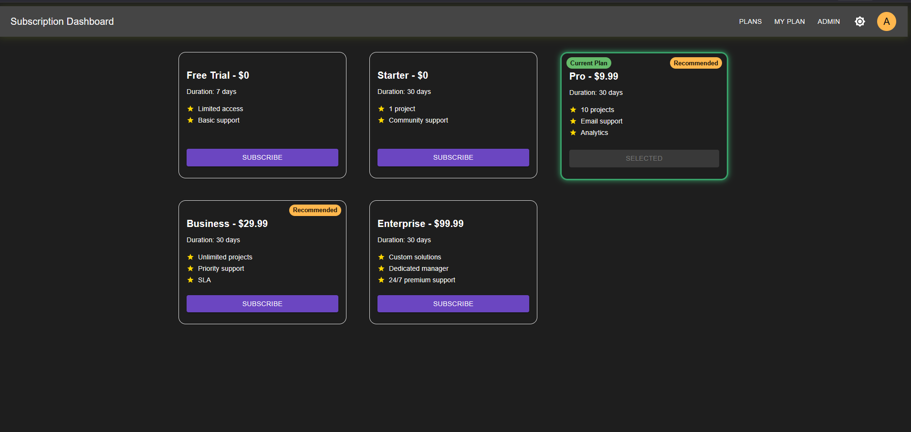
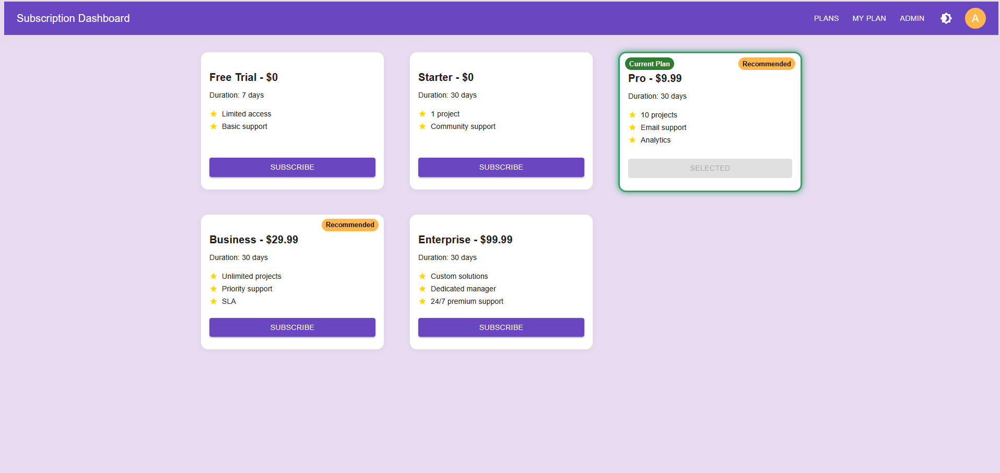
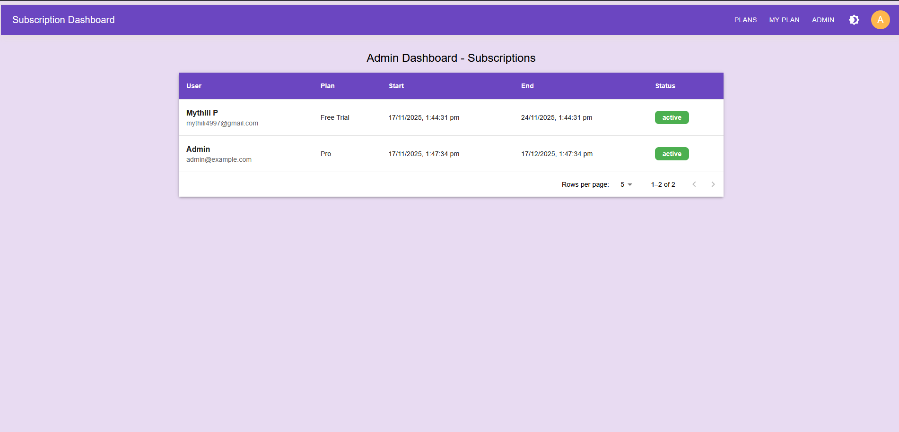
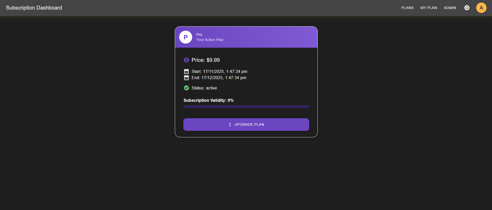
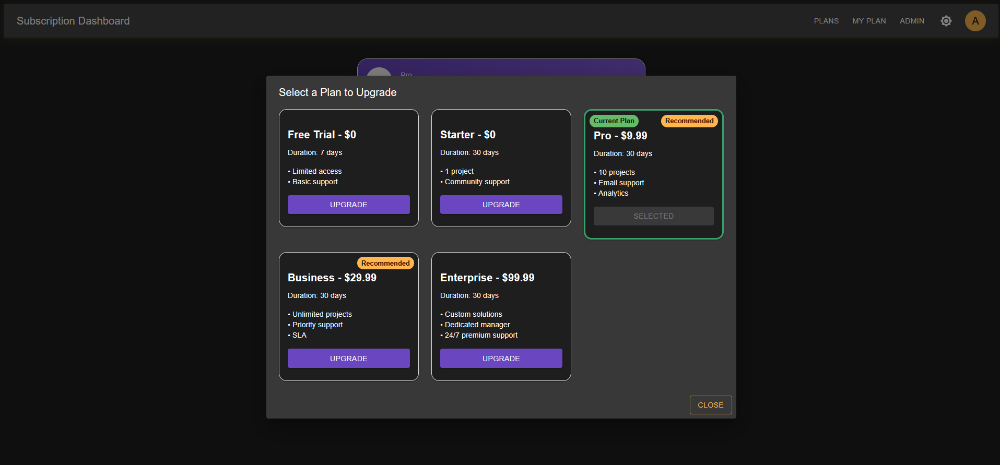
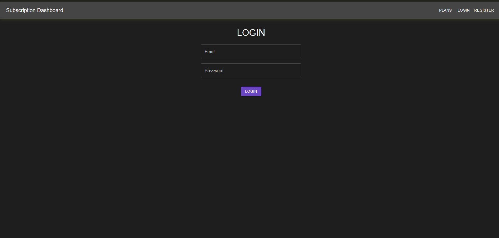
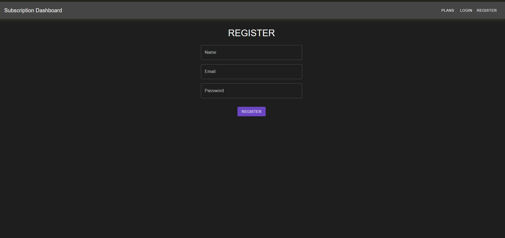

# Subscription Management Dashboard (MERN + MUI + THEME)

This repository contains a sample MERN project (backend + frontend) for a subscription management dashboard.

## Quick start - Backend
1. cd backend
2. npm install
3. npm run seed
4. npm run dev

## Quick start - Frontend
1. cd frontend
2. npm install
3. In .env  file  set VITE_API_URL (e.g. http://localhost:5000/api)
4. npm run dev

#### The admin can view which plans the users are subscribed to.
Admin credentials:
1.Email: admin@example.com
2.Password: admin123

###### Screenshots
1. 
2.
3.
4.
5.
6.
7.
8.

##### User Flow Explanation

1. Landing / Plans Page***
When a new user visits the site, they are directed to the Plans page (/plans) where they can see available subscription plans.
They can choose to Register if they don’t have an account yet.

2. Registration***
The user clicks Register and fills in the registration form with email, password, and other required details.
On successful registration:
The user is automatically logged in.
A success notification (snackbar) is displayed: “Registration successful!”.
The user is redirected to the Plans page to choose a subscription.

3.Login (Existing User)***
Existing users can go to the Login page (/login) and enter their email and password.
On successful login:
A success notification is displayed: “Login successful!”.
The system checks if the user has an active subscription:
If yes: Redirect to Dashboard (/dashboard).
If no: Redirect to Plans (/plans) to select a subscription.

4. Subscribing to a Plan)***
On the Plans page, the user selects a plan.
After subscribing:
The subscription becomes active.
Any previous active subscriptions are marked as expired automatically.
The user is redirected to their Dashboard, where they can see their subscription details.

5. Dashboard***
Shows active subscription details.
Provides access to features based on the subscription.

6. Admin Flow***
Admin logs in using:
Email: admin@example.com
Password: admin123
Admin can access Admin Dashboard (/admin/subscriptions) to:
View all users and their active subscriptions.
monitor subscription status.

8. Token & Security***
All authenticated requests use a JWT token stored in localStorage.
Unauthorized access redirects the user to the Login page.

